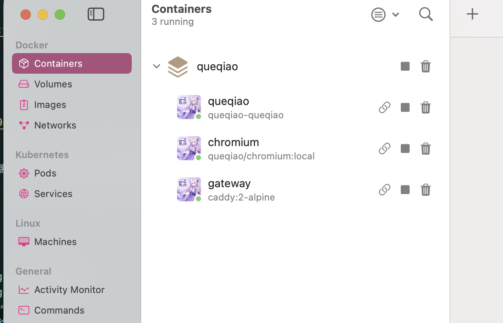

# Queqiao 鹊桥

<p align="center">
  
</p>


部署在OrbStack 进行运行和开发！ img目录提供部分图片！！


管理外网和内网 Web 快速链接的轻量控制台。

## 功能

- Flask + SQLite + WebSocket
- 默认账号：`root` / `root`
- 每个链接支持自定义名称、图片、外网地址、内网地址
- 支持 `http` 和 `https`
- 磁贴风格管理界面

## 快速 Docker 部署

适合直接在服务器或本机用 Docker 启动完整环境，包含主应用、Chromium 透传容器和 Caddy 网关。

```bash
git clone git@github.com:bilibilifmk/Queqiao.git queqiao
cd queqiao

# 生产环境请使用强随机密钥
export QUEQIAO_SECRET_KEY="$(openssl rand -hex 32)"

# 如果通过域名或服务器 IP 访问，加入对应主机名/IP
export CADDY_HOSTS="localhost, 127.0.0.1"

docker compose up -d --build
```

默认访问地址：

```text
https://127.0.0.1:9808
```

HTTP 端口也会开放：

```text
http://127.0.0.1:9807
```

建议日常使用 HTTPS 端口。首次登录后请立刻修改默认账号 `root` / `root` 的密码。

常用命令：

```bash
docker compose ps
docker compose logs -f queqiao
docker compose logs -f chromium
docker compose down
```

## 运行依赖

本地开发：

- Python `>= 3.9`
- `uv`
- SQLite，使用 Python 标准库 `sqlite3`
- Python 包：
  - `flask>=3.0.0`
  - `flask-sock>=0.7.0`
  - `requests>=2.32.0`

Docker 部署：

- Docker
- Docker Compose
- Caddy 镜像：`caddy:2-alpine`
- 本仓库的 `docker/chromium-src`，用于构建 `queqiao/chromium:local`
- OrbStack 可读取 `dev.orbstack.icon` label，容器图标使用 `/static/orbstack-logo.png`

## 本地启动

```bash
uv sync
uv run python run.py
```

打开 `http://127.0.0.1:8000`。

也支持：

```bash
uv run python run.app
```

生产环境请设置：

```bash
export QUEQIAO_SECRET_KEY="your-secret"
export QUEQIAO_DATABASE="/data/queqiao.sqlite3"
# 可选：调整图片上传上限，默认 8MB
export QUEQIAO_IMAGE_MAX_BYTES="$((8 * 1024 * 1024))"
# 可选：调整 WS 透传单个资源上限，默认 128MB
export QUEQIAO_WS_PROXY_MAX_BYTES="$((128 * 1024 * 1024))"
# 可选：调整透传空闲释放时间，默认 1800 秒；设置为 0 可关闭
export QUEQIAO_PROXY_IDLE_SECONDS=1800
```

## 环境变量

应用服务：

| 变量 | 默认值 | 说明 |
| --- | --- | --- |
| `HOST` | `0.0.0.0` | Flask 监听地址 |
| `PORT` | `8000` | Flask 监听端口 |
| `QUEQIAO_SECRET_KEY` | `change-this-in-production` | 生产环境必须覆盖 |
| `QUEQIAO_DATABASE` | `/app/data/queqiao.sqlite3` | SQLite 数据库路径 |
| `QUEQIAO_IMAGE_MAX_BYTES` | `8388608` | 图片上传最大字节数，默认 8MB |
| `QUEQIAO_WS_PROXY_MAX_BYTES` | `134217728` | WS 透传单资源最大字节数 |
| `QUEQIAO_PROXY_IDLE_SECONDS` | `1800` | 透传空闲释放时间，秒；设置为 `0` 可关闭 |
| `QUEQIAO_CHROMIUM_AUTH_TTL` | `3600` | Chromium 透传认证 cookie 有效期，秒 |

网关服务：

| 变量 | 默认值 | 说明 |
| --- | --- | --- |
| `HTTP_PORT` | `9807` | 对外 HTTP 端口，建议仅用于本地调试或兼容场景 |
| `HTTPS_PORT` | `9808` | 对外 HTTPS 端口，推荐日常使用 |
| `CADDY_HOSTS` | `localhost, 127.0.0.1` | Caddy 站点主机名/IP |

证书文件：

| 路径 | 说明 |
| --- | --- |
| `data/certs/*.crt` | 自定义 HTTPS 证书 |
| `data/certs/*.key` | 自定义 HTTPS 私钥 |
| `data/certs/*.caddy` | Caddy 站点配置片段，会自动导入 |

## Docker 部署（HTTP + HTTPS）

已提供完整 Docker 编排，包含：

- `queqiao`：本项目 Flask 服务
- `chromium`：`linuxserver/docker-chromium`，用于内网透传目标
- `gateway`：Caddy 网关，对外暴露 HTTP `9807` 和 HTTPS `9808`

### 1. 启动

```bash
export QUEQIAO_SECRET_KEY="$(openssl rand -hex 32)"
docker compose up -d --build
```

推荐访问 HTTPS 端口：

```text
https://127.0.0.1:9808
```

HTTP 端口也会开放，主要用于本地调试或兼容场景：

```text
http://127.0.0.1:9807
```

建议日常使用 HTTPS 端口。登录、透传和远程 Chromium 会涉及认证 cookie 与 WebSocket，HTTPS 更适合作为默认入口。

如需自定义对外端口，可设置环境变量：

```bash
export HTTP_PORT=8080
export HTTPS_PORT=8443
docker compose up -d --build
```

此时访问：

```text
http://127.0.0.1:8080
https://127.0.0.1:8443
```

如果通过服务器 IP 或域名访问，请同时把访问用的主机名加入 Caddy 站点列表：

```bash
export CADDY_HOSTS="localhost, 127.0.0.1, your-domain.example.com, 192.0.2.10"
docker compose up -d --build
```

注意：默认使用 Caddy 内置私有证书（`tls internal`），浏览器可能提示证书不受信任。

### 2. 自定义证书

项目会把宿主机 `data/certs` 挂载到 Caddy 容器的 `/certs`，并自动导入 `/certs/*.caddy`。


如果要换成公网可信证书，把正式证书和私钥覆盖到同名文件后重启网关：

```bash
docker compose up -d gateway
```

也可以新增其他域名证书，按下面形式放入 `data/certs/<domain>.caddy`：

```caddyfile
your-domain.example.com {
	tls /certs/your-domain.example.com.crt /certs/your-domain.example.com.key
	import queqiao_routes
}
```


### 3. 服务架构

```text
Browser
  -> Caddy :9807 / :9808
    -> /                -> queqiao:8000
    -> /static/*        -> queqiao:8000
    -> /ws              -> queqiao:8000
    -> /chromium/*      -> forward_auth /auth/chromium -> chromium:3000
```

透传流程：

```text
用户点击「透传」
  -> /chromium-launch/<link_id>/
  -> Flask 校验 queqiao_token cookie
  -> 写入短期 queqiao_chromium_auth cookie
  -> iframe 加载 /chromium/
  -> 通过 Selkies command 通道让容器内 Chromium 打开 internal_url
```

### 4. 链接配置

新增或编辑链接时：

- `名称`：卡片标题
- `图片`：支持 `png`、`jpg`、`jpeg`、`gif`、`webp`，默认最大 8MB；非 1:1 图片会进入裁剪
- `内网地址`：透传目标，例如 `http://172.16.1.7:5000`
- `外网地址`：普通外网跳转地址，可选
- `启用透传`：开启后显示「透传」入口

注意：`internal_url` 是由服务器或 Chromium 容器访问的地址，不是浏览器本机访问地址。

### 5. 透传到 docker-chromium

在鹊桥后台新增或编辑链接时，设置：

- `内网地址`: `http://chromium:3000`
- `启用透传`: 开启

点击「透传」后会执行：

- 主页面完成登录认证
- 打开 `/chromium-launch/<id>/`
- 启动页嵌入 `/chromium/...`，由 Caddy 转发到 `chromium` 服务
- Selkies command 通道让容器内 Chromium 打开目标链接的内网地址
- 如果容器内 Chromium 被关闭，`RESTART_APP=true` 会自动拉起浏览器，启动页会继续恢复目标地址
- macOS 中文输入法会在启动页内转换为远端文本输入，减少中文模式只输入英文、英文模式变大写等按键状态问题
- 透传页面默认空闲 30 分钟后会释放资源：WS 透传会关闭 WebSocket、清理 Blob URL 和 iframe；Chromium 透传会停止保活并清理远端 Chromium 进程
- 主界面右上角设置一级菜单里可以点击「立即释放透传」，会关闭当前 WS 透传上游连接，并通知同浏览器里已打开的透传页立即释放
- 透传页面会显示鹊桥 logo，便于和目标站点页面区分

如果 macOS 输入法仍异常，先点击一下透传页面里的目标输入框再输入；远端文本注入失败日志在 `chromium` 容器内的 `/tmp/queqiao-ime.log`。

### 6. 本地修改 docker-chromium 再构建

项目已支持把 `docker-chromium` 源码放在：`docker/chromium-src`。

如果你要定制 Chromium 镜像：

```bash
# 首次拉取
git clone --depth 1 https://github.com/linuxserver/docker-chromium.git docker/chromium-src

# 修改 docker/chromium-src 下内容后，重建 chromium 服务
docker compose build chromium

# 重新启动
docker compose up -d
```

`docker-compose.yml` 中 `chromium` 服务已改为本地构建（`build: ./docker/chromium-src`）。

### 7. 停止与备份

```bash
docker compose down
```

保留数据停止：

```bash
docker compose stop
```

备份数据：

```bash
tar czf queqiao-data-backup.tgz data docker/chromium/config
```

## 安全说明

已实现：

- 登录密码使用 Werkzeug 哈希存储
- 会话 token 使用 `secrets.token_urlsafe(32)`
- Chromium 透传使用单独 HMAC token，并有过期时间
- `/chromium/*` 经 Caddy `forward_auth` 保护
- WebSocket API 每个业务请求都会校验 token
- 上传图片默认最大 8MB，由 `QUEQIAO_IMAGE_MAX_BYTES` 和 Flask `MAX_CONTENT_LENGTH` 限制
- 上传图片保存到 `data/img`，数据库只保存 `/img/...` 路径或 `http(s)` 图片地址，不保存图片二进制内容
- 图片上传已禁用 SVG，并增加文件头校验
- 响应增加基础安全头：
  - `X-Content-Type-Options: nosniff`
  - `X-Frame-Options: SAMEORIGIN`
  - `Referrer-Policy: no-referrer`
  - `Permissions-Policy: camera=(), microphone=(), geolocation=()`
- 透传新页面不再把主登录 token 放到 `chromium_url` 查询参数里
- 透传页面增加空闲释放和手动立即释放；页面关闭、WebSocket 断开或用户点击「立即释放透传」时会释放上游连接，降低长期挂载占用

运维注意：

- 首次部署后必须修改默认账号 `root/root` 的密码
- 生产环境必须设置强随机 `QUEQIAO_SECRET_KEY`
- 透传本质上允许已登录用户让服务端或 Chromium 容器访问 `internal_url`，请只给可信用户开放
- 默认使用 Caddy 内部证书，公网生产建议换成正式证书，或在上游反向代理终止 TLS
- SQLite 数据库和上传图片位于 `data/`，请纳入备份

## 常用排查

查看容器状态：

```bash
docker compose ps
```

查看应用日志：

```bash
docker compose logs -f queqiao
```

查看 Chromium 日志：

```bash
docker compose logs -f chromium
```

验证 HTTPS 首页：

```bash
curl -k https://127.0.0.1:9808/
```

验证 HTTP 首页：

```bash
curl http://127.0.0.1:9807/
```

验证 Chromium 透传鉴权：

```bash
curl -k -I https://127.0.0.1:9808/chromium/
```
